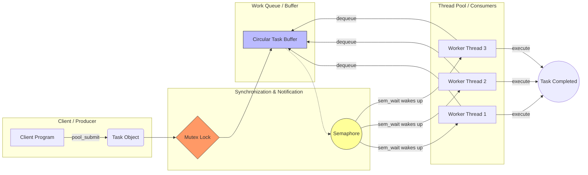
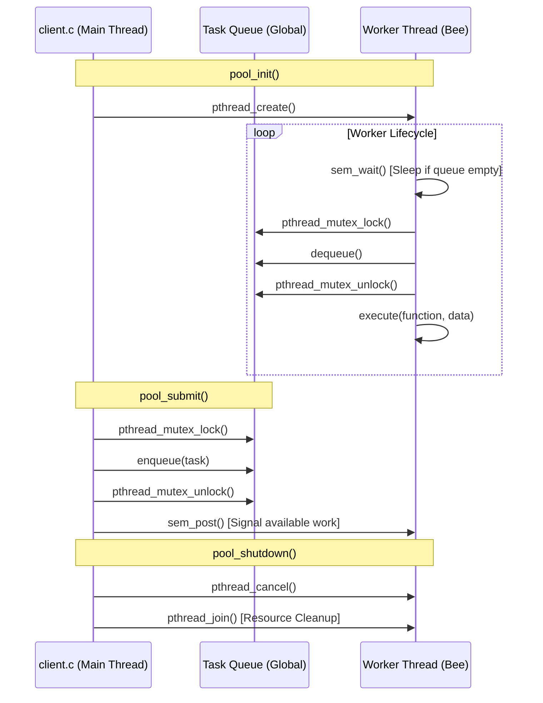

# Designing a Thread Pool(posix-thread-pool)

## 1. Project Overview
### Goal
- Implement a Thread Pool in C using the Pthreads API to efficiently manage and execute asynchronous tasks.

### Core Architecture
*   The system uses a **Producer-Consumer** model:
    *   **Producer (Client)**: Submits tasks to a shared queue.
    *   **Consumer (Worker Threads)**: 3 pre-created threads that wait for work and execute tasks.
    *   **Buffer**: A circular task queue with a fixed capacity of 10

### Synchronization Mechanism
*   **Mutex**: Protects the shared queue from simultaneous access (Race Conditions).
*   **Semaphore**: Notifies idle threads when a new task is added (avoids Busy Waiting)

### Key API Functions
*   **`pool_init()`**: Sets up locks, semaphores, and starts worker threads.
*   **`pool_submit()`**: Adds a task to the queue and signals a worker.
*   **`worker()`**: The main loop for threads to wait, fetch, and run task.
*   **`pool_shutdown()`**: Cancels all threads and cleans up resources.

## 2. Team Members and Responsibility
- Chen, Ban-Ban (陳半半): Architect the threads lifecycle => Part A
- Kuan, Chin-Wei (官京緯): To be defined.
- Simone Cheng: Consumer => Part C
## 3. Implementation Details

#### **Coordination Agreement**
*   **Circular Buffer Logic**: 
    *   `head`: Index where the Worker takes the next task.
    *   `tail`: Index where the Client puts a new task.
    *   **Formula**: Use `index = (index + 1) % QUEUE_SIZE` to move the pointer.
*   **The `count` Variable**: 
    *   **Producer**: Must do `count++` after adding a task.
    *   **Consumer**: Must do `count--` after taking a task.
*   **Locking Order**: 
    *   **Worker**: Must call `sem_wait()` **before** `pthread_mutex_lock()` to avoid Deadlock.
---
#### **Part A: The Architect (Lifecycle)**
*   **Functions**: `pool_init()`, `pool_shutdown()`.
*   **Tasks**:
    *   Define global variables: `queue`, `lock`, `sem`, and `bee[]`.
    *   **Init**: Initialize Mutex/Semaphore and create 3 threads using a loop.
    *   **Shutdown**: Send `pthread_cancel` to all bees and use `pthread_join` to clean up resources.

#### **Part B: The Producer (Submission)**
*   **Functions**: `pool_submit()`, `enqueue()`.
*   **Tasks**:
    *   **Enqueue**: Check if `count == QUEUE_SIZE`. If not, put task in `queue[tail]` and update `tail`.
    *   **Submit**: Wrap function/data into a `task` struct, use Mutex for safety, and call `sem_post()` to wake up a worker.

#### **Part C: The Consumer (Worker)**
*   **Functions**: `worker()`, `dequeue()`.
*   **Tasks**:
    *   **Worker**: Create a `while(TRUE)` loop. Wait for a signal via `sem_wait()`, lock the mutex, get a task, and call `execute()`.
    *   **Dequeue**: Remove task from `queue[head]`, update `head`, and decrement `count`.
---

## Flow diagram

## Sequence diagram


## 4. Compilation and Configuration Instructions
### Environment
* **Tested on**: Ubuntu 20.04 (WSL2)
* **Requirements**: `gcc`
* **Library**: POSIX Pthreads (-lpthread)

### Compile the program
**Compile**: Use the `Makefile`.
    ```bash
    make
    ```
### Run the Program
**Run**: Execute the generated `example` file.
    ```bash
    ./example
    ```
## 5. The Expected and final Test Results

### The expected result
**Expectation**: You should see the message: `I add two values 5 and 10 result = 15`
### The final result
(Snapshoot placeholder)


## 6. File Structure
*   **`threadpool.h`**: Function prototypes.
*   **`threadpool.c`**: Core pool logic and synchronization.
*   **`client.c`**: Test program to verify the pool.
*   **`Makefile`**: Automated build script.


Author: Kuan, Chin-Wei (官京緯), Chen, Ban-Ban (陳半半), Zheng, Nai-Zhen(鄭乃甄)

Date: May-2026


## Appendix

### Assignment completed description
Project 1—Designing a Thread Pool
Thread pools were introduced in Section 4.5.1. When thread pools are used, a
task is submitted to the pool and executed by a thread from the pool. Work is
submitted to the pool using a queue, and an available thread removes work
from the queue. If there are no available threads, the work remains queued
until one becomesavailable.Ifthereis nowork,threadsawaitnotificationuntil
a task becomes available.
This project involves creating and managing a thread pool, and it may be
completed using either Pthreds and POSIX synchronization or Java. Below we
provide the details relevant to each specific technology.
I. POSIX
The POSIX version of this project will involve creating a number of threads
using the Pthreads API as well as using POSIX mutex locks and semaphores
for synchronization.
P-36
Chapter 7 Synchronization Examples
The Client
Users of the thread pool will utilize the following API:
• void pool init()—Initializes the thread pool.
• int pool submit(void (*somefunction)(void *p), void *p)—
where somefunction is a pointer to the function that will be executed by
a thread from the pool and p is a parameter passed to the function.
• void pool shutdown(void)—Shutsdownthethreadpooloncealltasks
have completed.
Weprovide an example program client.c in the source code download that
illustrates how to use the thread pool using these functions.
Implementation of the Thread Pool
InthesourcecodedownloadweprovidetheCsourcefilethreadpool.c as
a partial implementation of the thread pool. You will need to implement the
functions that are called by client users, as well as several additional functions
that support the internals of the thread pool. Implementation will involve the
following activities:
1. The pool init() function will create the threads at startup as well as
initialize mutual-exclusion locks and semaphores.
2. The pool submit() function is partially implemented and currently
places the function to be executed—as well as its data— into a task
struct. The taskstructrepresentsworkthatwillbecompletedbyathread
in the pool. pool submit() will add these tasks to the queue by invok
ing the enqueue() function, and worker threads will call dequeue() to
retrieve work from the queue. The queue may be implemented statically
(using arrays) or dynamically (using a linked list).
The pool init() function has an int return value that is used to
indicate if the task was successfully submitted to the pool (0 indicates
success, 1 indicates failure). If the queue is implemented using arrays,
pool init() will return 1 if there is an attempt to submit work and the
queue is full. If the queue is implemented as a linked list, pool init()
should always return 0 unless a memory allocation error occurs.
3. Theworker()functionisexecutedbyeachthreadinthepool,whereeach
thread will wait for available work. Once work becomes available, the
thread will remove it from the queue and invoke execute() to run the
specified function.
Asemaphore can be used for notifying a waiting thread when work
is submitted to the thread pool. Either named or unnamed semaphores
may be used. Refer to Section 7.3.2 for further details on using POSIX
semaphores.
Programming Projects
P-37
4. A mutex lock is necessary to avoid race conditions when accessing or
modifying the queue. (Section 7.3.1 provides details on Pthreads mutex
locks.)
5. Thepool shutdown()function will cancel each worker thread and then
wait for each thread to terminate by calling pthread join(). Refer to
Section 4.6.3 for details on POSIX thread cancellation. (The semaphore
operation sem wait()isacancellation point that allows athread waiting
on a semaphore to be cancelled.)
Refer to the source-code download for additional details on this project. In
particular, the README file describes the source and header files, as well as the
Makefile for building the project.